# 🌟 CareerBloom - AI-Powered Career Development Platform

CareerBloom is a comprehensive career development platform that leverages AI to help users build resumes, find jobs, assess skills, and plan career paths. Built with React, Node.js, and integrated with multiple AI services including Google Gemini AI.

## 📋 Table of Contents

- [📸 Screenshots](#-screenshots)
- [🚀 Features Overview](#-features-overview)
- [🛠️ Technology Stack](#️-technology-stack)
- [📋 Prerequisites](#-prerequisites)
- [🔧 Setup Instructions](#-setup-instructions)
- [🔑 Required API Keys](#-required-api-keys)
- [📁 Project Structure](#-project-structure)
- [🚦 Getting Started Guide](#-getting-started-guide)
- [🔌 API Documentation](#-api-documentation)
- [🧠 AI Prompting Strategies Used](#-ai-prompting-strategies-used)
- [🔧 Development](#-development)
- [🐛 Troubleshooting](#-troubleshooting)
- [🤝 Contributing](#-contributing)
- [📄 License](#-license)
- [🆘 Support & Community](#-support--community)
- [🙏 Acknowledgments](#-acknowledgments)

## 📸 Screenshots

### **🏠 Dashboard Overview**

*Main dashboard with all career development tools and features*

### **📝 Resume Builder & Customizer**

*AI-powered resume builder with professional templates and real-time preview*

### **🎯 Job Recommendations**

*Smart job matching system with personalized recommendations based on skills*

### **📊 Skill Assessment**

*Interactive skill assessments with AI-generated questions and detailed feedback*

### **🛤️ Career Path Predictor**

*4-stage career roadmaps with learning resources and actionable steps*

### **📈 Job Trends & Analytics**

*Market trend analysis with salary insights and skills demand tracking*

### **🤖 AI Chatbot Integration**

*Context-aware career advisor with job-specific guidance and interview preparation*

### **🏢 Company Discovery**

*Company profiles and industry insights for informed career decisions*

---

## ✨ **Feature Highlights**

| 🎯 **Feature** | 🔧 **Technology** | 🚀 **Capability** |
|---|---|---|
| **AI Resume Builder** | Gemini AI + Templates | Generate professional resumes with 6 templates |
| **Job Matching** | Vector Similarity + JSearch API | Find relevant jobs with 90%+ accuracy |
| **Skill Assessment** | Adaptive AI Questions | 15-question assessments across 4 domains |
| **Career Roadmaps** | Hierarchical AI Planning | 4-stage development plans with resources |
| **Resume Customization** | Context-Aware Prompting | Tailor resumes for specific job descriptions |
| **Market Analytics** | Real-time Data Analysis | Track trends and salary insights |
| **AI Career Advisor** | Conversational AI | Personalized guidance and interview prep |
| **Company Intelligence** | Data Aggregation | Comprehensive company profiles and insights |

## 🎬 **Quick Demo Journey**

### **👤 User Journey: From Resume to Dream Job**

```mermaid
graph LR
    A[📝 Build Resume] --> B[🎯 Get Job Matches]
    B --> C[📊 Assess Skills]
    C --> D[🛤️ Plan Career Path]
    D --> E[🤖 Get AI Advice]
    E --> F[🏢 Apply to Companies]

    style A fill:#e1f5fe
    style B fill:#f3e5f5
    style C fill:#e8f5e8
    style D fill:#fff3e0
    style E fill:#fce4ec
    style F fill:#e0f2f1
```



1. **📝 Start with Resume Builder** → Create professional resume with AI assistance
2. **🎯 Get Job Recommendations** → Find matching opportunities based on your skills
3. **📊 Take Skill Assessments** → Identify strengths and growth areas
4. **🛤️ Generate Career Roadmap** → Plan your 4-stage career progression
5. **🤖 Chat with AI Advisor** → Get personalized career guidance
6. **🏢 Explore Companies** → Research potential employers and opportunities

## 🚀 Features Overview

### 📝 **Resume Builder & Customizer**
- **AI-Powered Resume Generation** with 6 professional templates
- **Job-Specific Resume Customization** using Gemini AI with advanced prompting strategies
- **ATS-Optimized Content** with keyword optimization and skills enhancement
- **Real-time Preview** and PDF export functionality
- **Paste Resume Feature** for quick text-based customization
- **Summary Replacement** and intelligent skills integration

### 🎯 **Job Recommendations System**
- **Smart Job Matching** using JSearch API integration with 1000+ real job listings
- **Vector-based Similarity Matching** using Pinecone for accurate recommendations
- **Skills-Based Filtering** with personalized job suggestions
- **Fallback Skills System** (Python, Java, React, Node.js, etc.) for enhanced matching
- **Real-time Job Data** from multiple job boards and platforms
- **Resume-to-Job Matching** with compatibility scoring

### 🏢 **Company Discovery**
- **Company Profiles** extracted from job data with detailed information
- **Industry Insights** and company culture analysis
- **Location-based Filtering** and advanced search capabilities
- **Company Size and Type** categorization

### 📊 **Skill Assessment & Analysis**
- **15-Question Assessments** per skill category with AI-generated questions
- **Adaptive Prompting** that adjusts difficulty based on user responses
- **Personalized Feedback** and comprehensive skill gap analysis
- **Progress Tracking** across Technology, Business, Healthcare, and Creative domains
- **Lightning AI Integration** for advanced resume analysis

### 🛤️ **Career Path Predictor**
- **4-Stage Career Roadmaps** with detailed progression plans and timelines
- **Hierarchical Prompting** for structured career guidance
- **Learning Resource Integration** (YouTube tutorials, Coursera courses)
- **Skills Development Timeline** with actionable steps and milestones
- **Multiple Career Domains** (Software Engineering, Data Science, Product Management, etc.)

### 📈 **Job Trends & Analytics**
- **Market Trend Analysis** using real job data with 7-day collection cycles
- **Data-Driven Prompting** for factual insights and predictions
- **Salary Insights** and growth predictions by location and role
- **Skills Demand Tracking** across industries and technologies
- **RAG-based Analytics** with comprehensive market intelligence

### 🤖 **AI Chatbot Integration**
- **Context-Aware Career Advice** using DeepSeek/Gemini AI
- **Role-Playing Prompting** as senior career counselor
- **Job-Specific Guidance** with automatic resume and job data integration
- **Interview Preparation** and personalized career planning support
- **Conversational AI** with multi-turn context preservation

### 📄 **Cover Letter Generator**
- **Fine-tuned GPT-2 Model** for personalized content generation
- **Template-Based Fallback** system for reliability
- **Job Description Integration** for highly targeted content
- **Professional Formatting** with multiple style options

## 🛠️ Technology Stack

### **Frontend**
- **React 18** with TypeScript for type safety
- **Tailwind CSS** for utility-first styling
- **Radix UI** components for accessibility
- **React Router** for client-side navigation
- **Clerk** for secure authentication
- **SWR** for efficient data fetching and caching

### **Backend**
- **Node.js** with Express framework
- **TypeScript** for full-stack type safety
- **MongoDB** with Mongoose ODM
- **Multer** for file upload handling
- **CORS** and comprehensive security middleware

### **AI & Machine Learning**
- **Google Gemini AI** (gemini-1.5-flash) with advanced prompting strategies
- **JSearch API** for comprehensive job data
- **Lightning AI** for resume analysis and skill extraction
- **Fine-tuned GPT-2** for cover letter generation
- **OpenAI Embeddings** for vector similarity matching

### **Vector Database & Search**
- **Pinecone** for high-performance similarity search
- **Vector Embeddings** for job-resume matching
- **RAG Architecture** for enhanced recommendations

## 📋 Prerequisites

Before setting up CareerBloom, ensure you have:

- **Node.js** (v16 or higher)
- **npm** or **yarn** package manager
- **MongoDB** (local installation or cloud instance)
- **Git** for version control
- **Chrome/Chromium** browser (for LinkedIn scraping)

## 🔧 Setup Instructions

### 1. **Clone the Repository**
```bash
git clone <repository-url>
cd career-bloom-engine-main
```

### 2. **Install Dependencies**

**Frontend Dependencies:**
```bash
npm install
```

**Backend Dependencies:**
```bash
cd server
npm install
cd ..
```

**Python Dependencies (for LinkedIn scraper):**
```bash
pip install -r requirements.txt
```

### 3. **Environment Configuration**

Create a `.env` file in the root directory with the following variables:

```env
# Clerk Authentication
VITE_CLERK_PUBLISHABLE_KEY=pk_test_your_clerk_key_here

# API Configuration
VITE_API_URL=http://localhost:5000

# Google Gemini AI (Required)
GEMINI_API_KEY=your_gemini_api_key_here

# MongoDB Database (Required)
MONGODB_URI=mongodb://localhost:27017/careerbloom

# JSearch API for Job Data (Required)
JSEARCH_API_KEY=your_jsearch_api_key_here

# Pinecone Vector Database (Optional - for enhanced job matching)
PINECONE_API_KEY=your_pinecone_api_key
PINECONE_ENVIRONMENT=your_pinecone_environment

# Lightning AI for Resume Analysis (Optional)
LIGHTNING_AI_TOKEN=your_lightning_ai_token
LIGHTNING_AI_ENDPOINT=https://your-lightning-endpoint.litng.ai/predict

# OpenAI (Optional - for embeddings if using Pinecone)
OPENAI_API_KEY=your_openai_api_key
```

### 4. **Database Setup**

**MongoDB Setup:**
```bash
# Start MongoDB service (if running locally)
mongod

# The database will be created automatically on first connection
```

**Pinecone Setup (Optional):**
1. Create account at [Pinecone](https://pinecone.io)
2. Create an index named `job-recommendations`
3. Set dimension to `1536` (for OpenAI embeddings)
4. Use cosine similarity metric

### 5. **Seed the Database**

**Populate with sample job data:**
```bash
npm run seed-jobs
```

This will:
- Generate 1000 diverse job listings
- Add jobs to MongoDB
- Create vector embeddings for job matching
- Set up the recommendation system

### 6. **Start the Application**

**Development Mode:**
```bash
# Terminal 1: Start backend server
cd server
npm run dev

# Terminal 2: Start frontend development server
npm run dev
```

**Production Mode:**
```bash
# Build frontend
npm run build

# Start production server
cd server
npm start
```

### 7. **Access the Application**
- **Frontend:** http://localhost:8080
- **Backend API:** http://localhost:5000
- **Health Check:** http://localhost:5000/api/health

## 🔑 Required API Keys

### **Essential APIs (Required for core functionality):**

1. **Google Gemini AI API**
   - Get from: [Google AI Studio](https://makersuite.google.com/app/apikey)
   - Used for: Resume customization, career advice, skill assessment
   - Cost: Free tier available

2. **JSearch API**
   - Get from: [RapidAPI JSearch](https://rapidapi.com/letscrape-6bRBa3QguO5/api/jsearch)
   - Used for: Real job data and recommendations
   - Cost: Free tier with 100 requests/month

3. **Clerk Authentication**
   - Get from: [Clerk Dashboard](https://clerk.com)
   - Used for: User authentication and management
   - Cost: Free tier for up to 10,000 users

4. **MongoDB**
   - Local installation or [MongoDB Atlas](https://www.mongodb.com/cloud/atlas)
   - Used for: Data storage
   - Cost: Free tier available

### **Optional APIs (Enhanced functionality):**

1. **Pinecone Vector Database**
   - Get from: [Pinecone](https://pinecone.io)
   - Used for: Enhanced job matching with vector similarity
   - Cost: Free tier available

2. **Lightning AI**
   - Custom endpoint for resume analysis
   - Used for: Advanced resume skill extraction
   - Cost: Varies by usage

3. **OpenAI API**
   - Get from: [OpenAI Platform](https://platform.openai.com)
   - Used for: Vector embeddings (if using Pinecone)
   - Cost: Pay-per-use

## 📁 Project Structure

```
career-bloom-engine-main/
├── 📁 src/                          # Frontend React application
│   ├── 📁 components/               # React components
│   │   ├── 📁 dashboard/           # Dashboard components
│   │   │   ├── ResumeBuilder.tsx   # AI-powered resume builder
│   │   │   ├── ResumeCustomizer.tsx # Job-specific customization
│   │   │   ├── JobRecommendations.tsx # Job matching system
│   │   │   ├── AssessmentQuiz.tsx  # Skill assessments
│   │   │   └── Chatbot.tsx         # AI career advisor
│   │   ├── 📁 career-tools/        # Career planning tools
│   │   │   └── CareerPathPredictor.tsx # Career roadmaps
│   │   └── 📁 layout/              # Layout components
│   ├── 📁 pages/                   # Page components
│   ├── 📁 services/                # API service functions
│   ├── 📁 contexts/                # React contexts
│   └── 📁 data/                    # Static data and configurations
├── 📁 server/                      # Backend Node.js application
│   ├── 📁 controllers/             # Route controllers
│   │   ├── resumeController.ts     # Resume operations
│   │   ├── resumeCustomizationController.ts # AI customization
│   │   ├── jobController.ts        # Job management
│   │   ├── jobRecommendationController.ts # Recommendation engine
│   │   └── coverLetterController.ts # Cover letter generation
│   ├── 📁 models/                  # MongoDB models
│   ├── 📁 routes/                  # API routes
│   ├── 📁 services/                # Business logic services
│   ├── 📁 utils/                   # Utility functions
│   ├── 📁 jobRecommendations/      # Job recommendation system
│   └── 📁 src/                     # Additional server source
│       └── 📁 services/            # AI services (Gemini, etc.)
├── 📁 public/                      # Static assets
├── 📁 docs/                        # Documentation
└── 📄 README.md                    # This file
```

## 🚦 Getting Started Guide

### **Step 1: First Time Setup**
1. Complete the installation following setup instructions above
2. Ensure all required API keys are configured in `.env`
3. Start MongoDB service
4. Run database seeding: `npm run seed-jobs`

### **Step 2: Launch Application**
1. Start backend: `cd server && npm run dev`
2. Start frontend: `npm run dev`
3. Open browser to http://localhost:8080

### **Step 3: Explore Features**
1. **Register/Login** using Clerk authentication
2. **Build Resume** - Use AI-powered resume builder with templates
3. **Customize Resume** - Paste resume text and job description for AI optimization
4. **Get Job Recommendations** - Upload resume or use skills for job matching
5. **Take Skill Assessments** - Evaluate your skills across different domains
6. **Generate Career Roadmap** - Get 4-stage career development plan
7. **Use AI Chatbot** - Get personalized career advice and guidance

## 🔌 API Documentation

### **Resume Customization API**

#### Customize Resume from Text
```http
POST /api/resume-customization/customize-text
Content-Type: application/json

{
  "resumeText": "Your complete resume text...",
  "jobDescription": "Target job description..."
}
```

#### Response
```json
{
  "success": true,
  "data": {
    "originalResume": "...",
    "customizedResume": "...",
    "newSummary": "AI-generated summary",
    "addedSkills": ["React.js", "Node.js", "AWS"]
  }
}
```

### **Job Recommendations API**

#### Get Recommendations from Resume
```http
POST /api/job-recommendations/recommendations
Content-Type: application/json

{
  "resumeText": "Your resume text...",
  "limit": 10
}
```

#### Get Job Trends
```http
GET /api/jobs/trends
```

### **Skill Assessment API**

#### Get Assessment Questions
```http
GET /api/assessments/questions/:category
```

#### Submit Assessment
```http
POST /api/assessments/submit
Content-Type: application/json

{
  "category": "technology",
  "answers": [1, 2, 0, 3, 1, ...]
}
```

### **Career Path API**

#### Generate Career Roadmap
```http
POST /api/career-path/generate
Content-Type: application/json

{
  "currentRole": "Junior Developer",
  "targetRole": "Senior Software Engineer",
  "skills": ["JavaScript", "React"]
}
```

## 🧠 AI Prompting Strategies Used

CareerBloom implements advanced AI prompting strategies for optimal results:

### **1. Few-Shot Prompting** 🎯
- **Used in:** Resume Builder, Content Generation
- **How:** Provides examples before requesting output
- **Benefit:** Consistent formatting and professional quality

### **2. Chain-of-Thought Prompting** 🔗
- **Used in:** Resume Customization, Skill Analysis
- **How:** Breaks complex tasks into logical steps
- **Benefit:** Better reasoning and more accurate results

### **3. Context-Aware Prompting** 📋
- **Used in:** All job-related features
- **How:** Includes relevant context (job descriptions, resume data)
- **Benefit:** Highly personalized and relevant outputs

### **4. Hierarchical Prompting** 🏗️
- **Used in:** Career Path Predictor
- **How:** Structures output in organized levels/stages
- **Benefit:** Clear, actionable career roadmaps

### **5. Adaptive Prompting** 🔄
- **Used in:** Skill Assessment, Chatbot
- **How:** Adjusts based on user responses and skill level
- **Benefit:** Personalized difficulty and relevant advice

### **6. Role-Playing Prompting** 🎭
- **Used in:** AI Chatbot, Career Advice
- **How:** AI assumes expert career counselor role
- **Benefit:** Professional, domain-specific guidance

## 🔧 Development

### **Available Scripts:**
```bash
# Frontend Development
npm run dev          # Start development server (Vite)
npm run build        # Build for production
npm run preview      # Preview production build
npm run lint         # Run ESLint

# Backend Development
cd server
npm run dev          # Start with nodemon (auto-restart)
npm start            # Start production server
npm run test         # Run test suite

# Database Operations
npm run seed-jobs    # Populate database with sample jobs
npm run clear-db     # Clear all data (use with caution)
```

### **Code Quality Tools:**
- **TypeScript** for type safety across frontend and backend
- **ESLint** for code linting and consistency
- **Prettier** for automatic code formatting
- **Husky** for git hooks (if configured)

### **Testing:**
```bash
# Run all tests
npm test

# Run specific test suites
npm run test:unit
npm run test:integration
npm run test:e2e
```

## 🐛 Troubleshooting

### **Common Issues:**

#### **1. LinkedIn Scraper Issues**
- Ensure Chrome/Chromium is installed
- Download matching ChromeDriver version
- Check if ChromeDriver is in system PATH
- Reduce scraping frequency if rate-limited

#### **2. AI API Errors**
- Verify Gemini API key is valid and has quota
- Check internet connection for API calls
- Review API usage limits and billing
- Use fallback mechanisms when available

#### **3. Database Connection Issues**
- Ensure MongoDB is running (`mongod` command)
- Check MongoDB URI in `.env` file
- Verify database permissions and access
- Check network connectivity for cloud databases

#### **4. Build/Deployment Issues**
- Clear node_modules and reinstall: `rm -rf node_modules && npm install`
- Check Node.js version compatibility (v16+)
- Verify all environment variables are set
- Review build logs for specific error messages

### **Performance Optimization:**
- Use SWR caching for API calls
- Implement lazy loading for components
- Optimize bundle size with code splitting
- Use MongoDB indexing for faster queries

## 🤝 Contributing

We welcome contributions to CareerBloom! Here's how to get started:

### **Development Workflow:**
1. **Fork** the repository
2. **Create** a feature branch (`git checkout -b feature/amazing-feature`)
3. **Make** your changes with proper TypeScript types
4. **Test** your changes thoroughly
5. **Commit** with descriptive messages (`git commit -m 'Add amazing feature'`)
6. **Push** to your branch (`git push origin feature/amazing-feature`)
7. **Open** a Pull Request with detailed description

### **Contribution Guidelines:**
- Follow existing code style and conventions
- Add TypeScript types for all new code
- Include tests for new functionality
- Update documentation for API changes
- Ensure all tests pass before submitting PR

### **Areas for Contribution:**
- 🐛 Bug fixes and performance improvements
- ✨ New AI prompting strategies
- 🎨 UI/UX enhancements
- 📚 Documentation improvements
- 🧪 Test coverage expansion
- 🌐 Internationalization support

## 📄 License

This project is licensed under the **MIT License** - see the [LICENSE](LICENSE) file for details.

## 🆘 Support & Community

### **Getting Help:**
- 📖 **Documentation:** Check `/docs` folder for detailed guides
- 🐛 **Issues:** Create GitHub issues for bugs and feature requests
- 💬 **Discussions:** Use GitHub Discussions for questions
- 📧 **Email:** Contact maintainers for urgent issues

### **API Health Checks:**
- **Backend Health:** http://localhost:5000/api/health
- **Database Status:** http://localhost:5000/api/db-status
- **AI Services:** http://localhost:5000/api/ai-health

## 🙏 Acknowledgments

Special thanks to the amazing services and tools that make CareerBloom possible:

- **🤖 Google Gemini AI** - Advanced AI capabilities and natural language processing
- **🔍 JSearch API** - Comprehensive real-time job data
- **🔐 Clerk** - Seamless authentication and user management
- **🎨 Radix UI** - Accessible and customizable UI components
- **⚡ Tailwind CSS** - Utility-first CSS framework
- **🗄️ MongoDB** - Flexible and scalable database solution
- **🔗 Pinecone** - High-performance vector database
- **⚡ Lightning AI** - Advanced resume analysis capabilities

## 🌟 Star History

If you find CareerBloom helpful, please consider giving it a star ⭐ on GitHub!

---

**🚀 Built with ❤️ for career growth and professional development**

*Empowering careers through AI-driven insights and personalized guidance*
